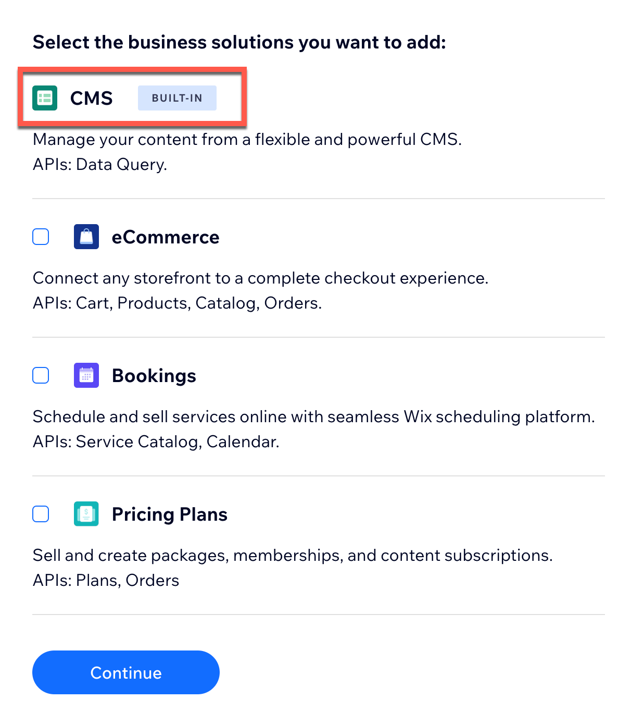

[](https://manage.wix.com/headless-funnel-nextjs/netlify?repository=https://github.com/wix/wix-cms-nextjs-template)   [](https://vercel.com/new/clone/hidden?integration-ids=oac_LZ0wUqGylqzgr8bE8a1R7JTE&skippable-integrations=1&build-command=yarn+build&deploymentIds=dpl_9Gtegfcme9RUmTXFvVGrP8BwDGUV&s=https%3A%2F%2Fgithub.com%2Fwix%2Fwix-cms-nextjs-template&demo-image=https%3A%2F%2Fgithub.com%2Fwix%2Fwix-cms-nextjs-template%2Fraw%2Fmain%2Fdocs%2Fmedia%2Ftemplate-showcase.gif&external-id=%7B%22repo%22%3A%22https%3A%2F%2Fgithub.com%2Fwix%2Fwix-cms-nextjs-template%22%2C%22referralInfo%22%3A%22repo-readme_education%22%7D&demo-title=Education+Starter&demo-description=Education+starter+template+with+Wix%E2%80%99s+Content+Management+solution.&demo-url=https%3A%2F%2Fvercel.cms-demo.wix.dev&repository-name=wix-cms-nextjs-template&referralInfo=repo-readme_education)

# A Wix Data Next.js Education Template


This template is a [Next.js](https://nextjs.org/) project bootstrapped with [`create-next-app`](https://github.com/vercel/next.js/tree/canary/packages/create-next-app). It uses [Wix Headless](https://dev.wix.com/api/sdk/about-wix-headless/overview) to leverage the Wix CMS business solution for managing the content on an education site.

## Part I: Get started

To integrate the Wix Content Manager business solution with the template, first create and set up a project on Wix:

### Step 1: Create a project on Wix

Create a [new Wix Headless project](https://www.wix.com/intro/headless?ref=netlify_github_education). For instructions on creating a Wix project, see [Create a Wix Headless Project](https://dev.wix.com/docs/go-headless/getting-started/setup/general-setup/create-a-project).

When prompted to add functionalities to your new project, you don't need to select any business solutions, since every Wix Headless project includes CMS support:



If needed, you can add business solutions to your project later. See [Add Apps to a Project](https://dev.wix.com/docs/go-headless/getting-started/setup/general-setup/add-apps-to-a-project).

### Step 2: Set up the Wix business solutions you need

In the project [dashboard](https://www.wix.com/my-account/site-selector/?buttonText=Select%20Site&title=Select%20a%20Site&autoSelectOnSingleSite=true&actionUrl=https:%2F%2Fwww.wix.com%2Fdashboard%2F%7B%7BmetaSiteId%7D%7D%2Fhome), click **Content Manager** in the sidebar menu to access the Content Manager.

For information on creating and managing collections, see [Getting Started with the Content Manager](https://support.wix.com/en/article/about-the-content-manager-7160473).

### Step 3: Authorize the template

There are 2 ways to authorize the template to access your Wix project:

+ [Option A: Quick start deployment](#option-a-quick-start-deployment).
+ [Option B: Create an OAuth client ID in the Wix dashboard](#option-b-create-an-oauth-client-id-in-the-wix-dashboard).

#### Option A: Quick start deployment

Click the quick start deployment link below to automatically authorize your template and configure your project. You'll be prompted to log in to your Wix account and to authorize the platform to access your project or site.

Authentication credentials are automatically incorporated into the template, making it easy to get started coding and customizing.

---

##### Netlify
[](https://app.netlify.com/sites/wix-cms-nextjs-template/deploys)

[](https://manage.wix.com/headless-funnel-nextjs/netlify?repository=https://github.com/wix/wix-cms-nextjs-template)


For more information, see [How to Deploy Next.js Sites to Netlify](https://www.netlify.com/blog/2020/11/30/how-to-deploy-next.js-sites-to-netlify/).

You can also view our [live demo site](https://netlify.cms-demo.wix.dev/). 

---

##### Vercel


[](https://vercel.com/new/clone/hidden?integration-ids=oac_LZ0wUqGylqzgr8bE8a1R7JTE&skippable-integrations=1&build-command=yarn+build&deploymentIds=dpl_9Gtegfcme9RUmTXFvVGrP8BwDGUV&s=https%3A%2F%2Fgithub.com%2Fwix%2Fwix-cms-nextjs-template&demo-image=https%3A%2F%2Fgithub.com%2Fwix%2Fwix-cms-nextjs-template%2Fraw%2Fmain%2Fdocs%2Fmedia%2Ftemplate-showcase.gif&external-id=%7B%22repo%22%3A%22https%3A%2F%2Fgithub.com%2Fwix%2Fwix-cms-nextjs-template%22%2C%22referralInfo%22%3A%22repo-readme_education%22%7D&demo-title=Education+Starter&demo-description=Education+starter+template+with+Wix%E2%80%99s+Content+Management+solution.&demo-url=https%3A%2F%2Fvercel.cms-demo.wix.dev&repository-name=wix-cms-nextjs-template&referralInfo=repo-readme_education)

For more information, see [How to Deploy Next.js Sites to Vercel](https://vercel.com/docs/frameworks/nextjs).

You can also view our [live demo site](https://vercel.cms-demo.wix.dev/). 

---

#### Option B: Create an OAuth client ID in the Wix dashboard

If you don't want to use quick-start deployment, begin by forking this repo to your git account.

Read [Set Up Authorization](https://dev.wix.com/api/sdk/auth:-headless-visitors/authorization:-create-an-oauth-app) in the Wix SDK documentation for instructions on how to manually create an OAuth app and generate a client ID in the [Headless Settings](https://www.wix.com/my-account/site-selector/?buttonText=Select%20Site&title=Select%20a%20Site&autoSelectOnSingleSite=true&actionUrl=https:%2F%2Fwww.wix.com%2Fdashboard%2F%7B%7BmetaSiteId%7D%7D%2Foauth-apps-settings) menu of the Wix dashboard.

After creating an OAuth app, store the Client ID in a secure location.

> **Note:** Do not push the client ID to your source control.

To set up environment variables for consuming Wix Headless APIs, follow these steps:

##### Local development environment

1. At the terminal, in the template's root folder, type `cp .env.template .env.local`.
2. In the new `.env.local` file, paste the client ID after `NEXT_PUBLIC_WIX_CLIENT_ID=`.

##### Production environment

In your deployment provider, add an environment variable called `NEXT_PUBLIC_WIX_CLIENT_ID` containing the client ID.

## Part II: Local Development

Once you’ve [authorized and configured](#part-i-get-started) your client, run the development server:

```shell
yarn
yarn dev
```

or

```shell
npm i
npm run dev
```

Open http://localhost:3000 with your browser to see the template home page.

You can start editing the homepage by modifying `app/page.tsx`. The page auto-updates as you edit the file.

Similarly, you can edit any other page on the pattern `app/<route>/page.tsx`. For more information, see [Defining Routes](https://beta.nextjs.org/docs/routing/defining-routes) in the Next.js documentation.

## Part III: Learn more about the tech stack

To learn how to customize the template and add more functionality using Wix APIs, see the [Wix JavaScript SDK reference documentation](https://dev.wix.com/api/sdk).

This template is written in [Next.js](https://nextjs.org/docs) 13 using [Next.js app directory](https://beta.nextjs.org/docs/app-directory-roadmap). To learn more about `Next.js`, see the following resources:

+ [Next.js documentation](https://nextjs.org/docs): Learn about Next.js features and APIs.
+ [Learn Next.js](https://nextjs.org/learn): An interactive Next.js tutorial.
+ [Next.js app directory](https://beta.nextjs.org/docs/app-directory-roadmap): Information on the Next.js App Router Roadmap.

Additionally, this template uses the following libraries and features:
+ [React Server Components](https://nextjs.org/docs/advanced-features/react-18/server-components)
+ [TypeScript](https://www.typescriptlang.org/docs/handbook/release-notes/typescript-4-9.html)
+ [TanStack Query <sup>v4</sup>](https://tanstack.com/query/latest)
+ [Tailwind CSS](https://tailwindcss.com/)
+ [Flowbite](https://flowbite.com/)
+ [Wix client SDK](https://dev.wix.com/api/sdk/introduction)

## Part IV: Deployment

You can deploy this repository using any platform which supports Next.js Version 13 and the [App Router Roadmap](https://beta.nextjs.org/docs/app-directory-roadmap).

The repository only requires a single environment variable: `NEXT_PUBLIC_WIX_CLIENT_ID`, which should contain a client ID authorizing access to a Wix project's data.

## Part V :Package dependency management

To ensure this repo always uses the latest APIs from the Wix JavaScript SDK, the repo is preconfigured with [Dependabot](https://docs.github.com/en/code-security/dependabot), GitHub's automated dependency management system. Due to the numerous pull requests generated by Dependabot, the repo also includes a preconfigured GitHub Action called "Combine PRs." This action can be executed manually to merge all of Dependabot's pull requests into a single PR, allowing for sanity checks to be performed only once. If the sanity check fails, each Dependabot PR can be inspected individually.

## Part VII :Testing

This repo is preconfigured with [Playwright](https://playwright.dev/) for both functional and UI (screenshots) testing.
It contains GitHub actions (for PRs) for both Netlify: [netlify-e2e.yml](../.github/workflows/netlify-e2e.yml) and Vercel: [vercel-e2e.yml](../.github/workflows/vercel-e2e.yml).

Feel free to delete the one you are not using.<br>
**Note**: there is a `# TODO: change to your site name` in both `YAML` files, please change the site name to the actual site name in the relevant deployment platform

### Screenshot Testing
This repo includes the screenshots to validate the initial site provided by this repo. Obviously, changing it to your needs would break these tests.<br>
To update the screenshots simply delete the failing ones under [location](../tests/e2e/__screenshots__), create a pull request and let the PR build fail, then head to `Netlify E2E / netlify-e2e`/`Vercel E2E / vercel-e2e` status checks, and under `Summary`, the screenshots generated by Playwright are available to download and update in the folder [location](../tests/e2e/__screenshots__)


